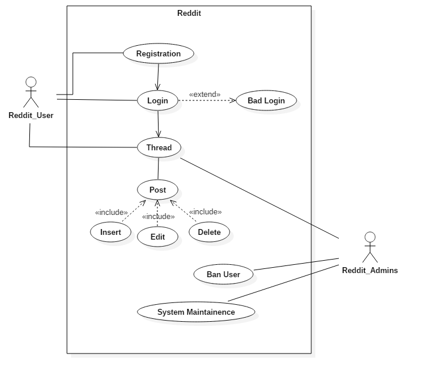

# Software Engineering - Reddit
https://github.com/Wargyy/reddit

**Year:** 2015 **Class:** 3MIEIC3

**Group:**
* Daniel Couceiro
* Diogo Cardoso
* Pedro Albano
* Pedro Faria

## Navigation

* [Requirement Elicitation](#requirement-elicitation)
* [Use-Cases Diagram](#use-cases-diagram)

[... Return to Chapter Select](Chapter_Select.md)

## Requirement Elicitation

Reddit accepts contributions to their code by using pull requests to their repository, as long as these follow the code standards and rules they set to use in their software.

Regarding issues and bugs, the repository's issue feature is only used to submit confirmed occurences of these, whereas unconfirmed and others, join suggestions and feature requests in a dedicated part of the website for this end, being that the 
[ideasfortheadmins](https://www.reddit.com/r/ideasfortheadmins/) subreddit.

Although these methods are available, they request that acknowledgements of more severe bugs and issues are sent to them using private channels, for security reasons.

Additionally due to Reddit's nature of being an 'open to everyone' website, where users are able to share, review and comment their content, it allows developers to have an instant feedback on how to improve the users experience.

## Use-Cases Diagram

